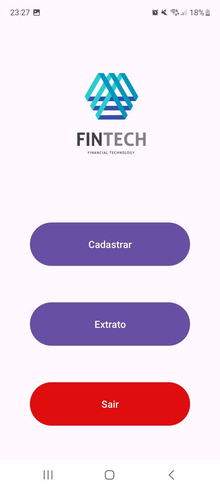
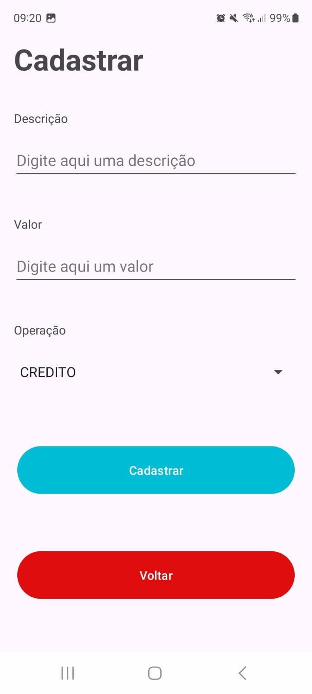
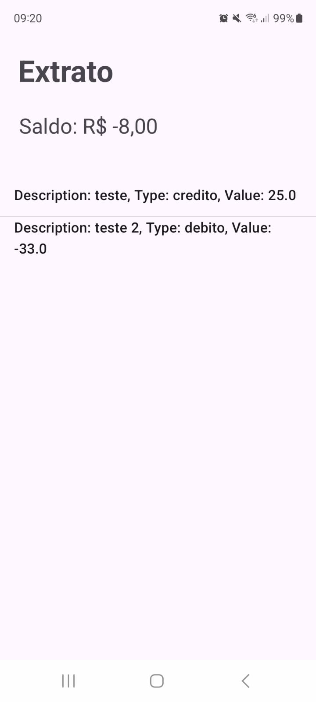

## Sobre o projeto

Projeto desenvolvido para a disciplina de Desenvolvimento Mobile 1 na especialização em Desenvolvimento Ágil de Software da UFPR. Neste projeto está desenvolvido um aplicativo para dispositivos android que contenham o sistema operacional a partir da versão 28.

### Tecnologias

Para desenvolver este projeto foram utilizadas as seguintes tecnologias:

* Kotlin
* Constraint Layout
* View-Activity

### Imagens do aplicativo

#### Tela inicial

#### Tela para cadastro de débitos e créditos

#### Tela de extrato

